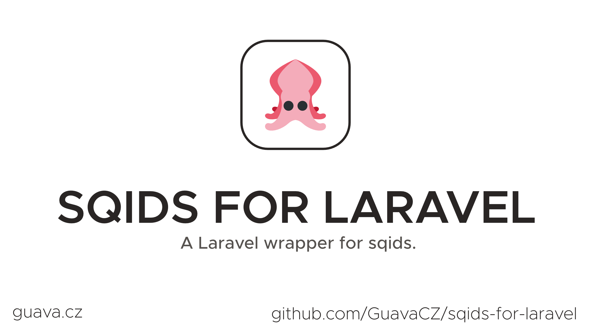

# Laravel wrapper for Sqids

[](https://packagist.org/packages/guava/sqids-for-laravel)
[](https://github.com/guava/sqids-for-laravel/actions?query=workflow%3Arun-tests+branch%3Amain)
[](https://packagist.org/packages/guava/sqids-for-laravel)

Laravel Wrapper for [sqids.org](https://sqids.org) PHP library.

## Support us

Your support is key to the continual advancement of our plugin. We appreciate every user who has contributed to our journey so far.

While our plugin is available for all to use, if you are utilizing it for commercial purposes and believe it adds significant value to your business, we kindly ask you to consider supporting us through GitHub Sponsors. This sponsorship will assist us in continuous development and maintenance to keep our plugin robust and up-to-date. Any amount you contribute will greatly help towards reaching our goals. Join us in making this plugin even better and driving further innovation.

## Installation

You can install the package via composer:

```bash
composer require guava/sqids-for-laravel
```

## Usage
This package adds a slightly modified version of the Sqids class, which allows a fluent configuration of all options. It also adds a salting option.

### Generating Sqids
There's multiple ways you can use this package to generate sqids:
```php
// Via our Facade
use Guava\Sqids\Facades\Sqids;

Sqids::encode([1,2,3]); /// Outputs '86Rf07'


// Via a classic instance
use Guava\Sqids\Sqids;
$sqids = new Sqids();
$sqids->encode([1,2,3]); /// Outputs '86Rf07'


// Via the app container / dependency injection
use Guava\Sqids\Sqids;
app(Sqids::class)->encode([1,2,3]); /// Outputs '86Rf07'


// Via our factory method, which simply returns an instance of Sqids
// The factory method is also available on the facade class
use Guava\Sqids\Sqids;
Sqids::make()->encode([1,2,3]);
```

It's entirely up to you which way you prefer. In our examples, we will make use of the factory method.

### Using in Eloquent Models
This package also comes with a trait that you can use in your Eloquent models. This trait will automatically add a sqid attribute which will be created from the model's primary key.
```php
use \Illuminate\Database\Eloquent\Model;
use \Guava\Sqids\Concerns\HasSqids;

class YourModel extends Model {
    use HasSqids;
    
    // ...
}
````
That's it! Now you can access the `sqid` attribute on your model.

You can custimize how the sqid on your model is generated by overriding the `getSqids` method:
```php
use \Illuminate\Database\Eloquent\Model;
use \Guava\Sqids\Concerns\HasSqids;
use \Guava\Sqids\Sqids;

class YourModel extends Model {
    use HasSqids;
    
    // ...
    
    protected function getSqids(): Sqids
    {
        return Sqids::make()
            ->salt() // This will use the model's class name as the salt, so every model generates different IDs
             // ... add more options here
        );
    }
}
```

### Route binding
If you want to be able to use the `sqid` as the route key, simply add the `HasSqidsRouting` trait to your model:
```php
use \Illuminate\Database\Eloquent\Model;
use \Guava\Sqids\Concerns\HasSqids;
use \Guava\Sqids\Concerns\HasSqidsRouting;

class YourModel extends Model {
    use HasSqids, HasSqidsRouting;
    
    // ...
}
```

### Options

#### Customizing the alphabet
```php
use Guava\Sqids\Sqids;

Sqids::make()
->alphabet('0123456789abcdef')
->encode([1,2,3]); /// Outputs 'c9bf67'
```

#### Customizing the minLength
```php
use Guava\Sqids\Sqids;

Sqids::make()
->minLength('8')
->encode([1,2,3]); /// Outputs '86Rf07xd'
```

#### Customizing the block list
```php
use Guava\Sqids\Sqids;

Sqids::make()
->blocklist(['86Rf07'])
->encode([1,2,3]); /// Outputs 'se8ojk'
```

#### Salting
Salting can be used to generate different IDs based on the provided salt, which can be any string or integer.

```php
use Guava\Sqids\Sqids;

Sqids::make()
->salt('my-salt')
->encode([1,2,3]); /// Outputs 'rx035W'
```

Salting is especially useful when used on Models with the `HasSqids` trait and you want every model to return different, unique IDs.

So for example a record of `Model1` with the ID 1 has a different sqid that a record of `Model2` with the ID 1.
```php
use \Illuminate\Database\Eloquent\Model;
use \Guava\Sqids\Concerns\HasSqids;
use \Guava\Sqids\Sqids;

class YourModel extends Model {
    use HasSqids;
    
    // ...
    
    protected function getSqids(): Sqids
    {
        return Sqids::make()
            ->salt() // This will use the model's class name as the salt, so every model generates different IDs
        );
    }
}
```

## Changelog

Please see [CHANGELOG](CHANGELOG.md) for more information on what has changed recently.

## Contributing

Please see [CONTRIBUTING](CONTRIBUTING.md) for details.

## Security Vulnerabilities

Please review [our security policy](../../security/policy) on how to report security vulnerabilities.

## Credits

- [Lukas Frey](https://github.com/lukas-frey)
- [All Contributors](../../contributors)
- Spatie - Our package skeleton is a modified version of [Spatie's Package Skeleton](https://github.com/spatie/package-skeleton-laravel)
- https://github.com/mtvs/eloquent-hashids

## License

The MIT License (MIT). Please see [License File](LICENSE.md) for more information.
